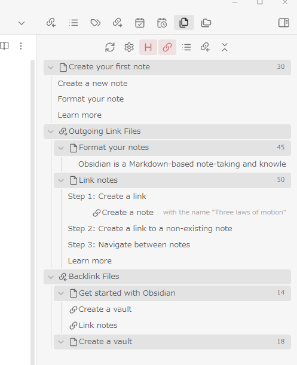
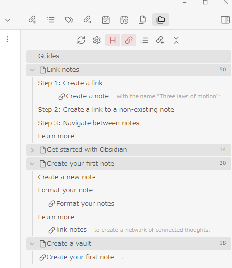
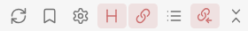

# Obsidian Multiple Notes Outline
ページ後半に日本語のドキュメントがあります。 
Japanese documentation is located on the second half of this page.  

## Introduction
This plugin helps you keep track of the outlines and relationships of multiple files with the following two views.

- File View
	- Lists the outlines of the active file, its outgoing link files, and its backlink files. That is, it outlines the local graph at depth 1 (backlink files of those files, so-called 2-hop links, can also be displayed).
- Folder View
	- Lists the outlines of files contained in a specific folder.

I have previously created a plugin called Daily Note Outline Plugin(https://github.com/iiz00/obsidian-daily-note-outline) that lists the outlines of multiple daily notes, and this is an adaptation of that plugin for regular files.  

## Usage
### Getting Started
Install MNO using Obsidian BRAT plugin and enable it. 
As noted in the 'About performance' section below, I recommend installing and activating Dataview community plugin to improve the speed of retrieving backlink files. 
Select Multiple Notes Outline: Open File View or Open Folder View from the command palette. 

### File View
Lists the outline of the active file and any files connected to it. 
The view is updated when another file becomes active, except when it is caused by clicking on an item in the MNO view by default. 
If you want the view to update even when you navigate to another file by clinking on MNO view, turn off "Suspend update by clicking on view items" in File View section of the settings. 

### Folder View
Lists the outlines of the files in the folder where the active file resides at startup. This view is updated only when the refresh icon is clicked. 

### UI icons
 
Click the refresh icon to focus on the currently active file or when you need to redraw the view.
The gear icon opens the settings window. Right-click to open a context menu to quickly change some settings. 
H, The Link, List, and Backlink icons show/hide the respective outline elements. 
Clicking the right-most icon(chevrons-down-up) collapses all outlines; clicking again undoes them.

### Always at the top of the list
Files specified individually or with tags specified in the settings screen can always be displayed at the top of the outline list. 
This function is intended to display files that are used as a table of contents or have a strong relationship to the active file/folder at the top of the list. 
To specify individual files, right-click on the file name you wish to display at the top and select Always display at the top from the context menu.  

## About performance
When you diplay outlines of many large files at once, a lot of processing is required. Usually this is not a problem, but if you are experiencing performance issues, please check the following. 

The two things that affect performance the most are getting backlinks and the number of elements to draw. 

### Retrieving backlink files and Dataview plugin
Normally, it takes a long time to retrieve backlink files. 
The Dataview plugin, one of the most popular community plugins, caches the vault's backlink information, and MNO attempts to use its cache when Dataview plugin is activated. 
In this case, the backlink information can be retrieved significantly faster than without Dataview. I recommend installing and activating Dataview plugin if possible. Alternatively, if you hide backlink files elements, MNO will stop retrieving backlink information, further reducing the load. 

### Number of elements to draw
The number of outline elements to be drawn is directly related to performance. If the number of files to be displayed is large, consider reducing the number of types of outline elements or the level of heading to be displayed. 

### read limit, process limit
To avoid too much processing, outline information is not read if the number of files to be displayed exceeds the number specified in "process limit" in the setting screen. 
Even if the number of files does not exceed "process limit", if the number of files exceeds the number specified in "read limit", the processing of subsequent files will be stopped. 
In these cases, the outline will be collapsed and only the file name will be displayed, so you can click the collapse icon to display the outline of the file. 

### Preview
MNO implements two types of previews: inline preview and tooltip preview, each of which takes time to process, though not as long as retrieving backlinks and drawing. If you do not need them, turn them off.  

## Misc.
Please tweak various settings from the settings screen. 

### Background color of file name
Depending on the theme you are using, the background color of the file name display may not match the theme. 
If this is the case, change "Note title background color" in the settings, and if none matches, select "custom" to specify a color of your choice.  

## Acknowledgement
In developing Daily Note Outline and Multiple Notes Outline, I have use many great plugins in Obsidian community as references. In particular,  
[Spaced Repetition by @st3v3nmw](https://github.com/st3v3nmw/obsidian-spaced-repetition) and [Recent Files by @tgrosinger](https://github.com/tgrosinger/recent-files-obsidian) for creating custom views. 
I also searched and referred to a bunch of posts in plugin-dev channel on Discord.  

## Buy Me A Coffee
If you like my plugin, I would appreciate it if you could buy me a cup of coffee! 
  

## Changelog
- 0.1.2
	- Fixed file view not working properly when backlinks are hidden.
- 0.1.1
	- Fixed
		- Fixed update processing when creating/renaming a file
		- Slightly delayed start of drawing at startup of Obsidian
- 0.1.0
	- Initial release.

  
# Obsidian Multiple Notes Outline 日本語ドキュメント

## Introduction 概要
本プラグインは以下の2つのビューで複数のファイルの内容や関係性を把握するのをサポートします。

- File View
	- アクティブなファイルと、そのアウトゴーイングリンクファイル、バックリンクファイルのアウトラインを一覧表示します。即ち、深度1のローカルグラフをアウトライン表示します（そのファイルのバックリンクファイル、いわゆる2-hop linkも表示可能です）。
- Folder View
	- 特定のフォルダに含まれるファイルのアウトラインを一覧表示します。

以前Daily Note Outline Pluginという複数のデイリーノートのアウトラインを一覧表示するプラグインを作成しましたが、それを通常のファイルに適用したものになります。  

## 使い方
### はじめに
Obsidian BRAT pluginを使用してインストールし、有効化してください。 
後述の「パフォーマンスについて」のセクションに記載しているとおり、バックリンクの取得スピード向上のために、可能であればDataviewプラグインをインストールし、有効化することを推奨します。 
コマンドパレットから Open File Viewまたは Open Folder Viewを選択してください。 

### File View
アクティブなファイル、およびそのファイルとリンク関係にあるファイルのアウトラインが一覧表示されます。 
ファイルエクスプローラやエディタ内のリンクから別ファイルに移動するとビューが更新されますが、初期設定ではMNOのviewのリストをクリックして別ファイルに移動した場合は更新されません。リストをクリックして移動した場合も更新したい場合は、設定のFile Viewの項の「Suspend update by clicking on view items」をオフにしてください。 

### Folder View
起動時にアクティブなファイルが存在するフォルダ内のファイルのアウトラインが一覧表示されます。こちらのビューは更新アイコンをクリックしたときのみ更新されます。 

### UI icon
 
更新アイコンは現在アクティブなファイルにフォーカスする場合や再描画が必要な時にクリックしてください。 
歯車アイコンは設定画面を開きます。右クリックでいくつかのオプションを素早く切り替えられます。 
H, リンク、リスト、バックリンクのアイコンはそれぞれのアウトライン要素の表示/非表示を切り替えます。 
一番右のアイコンをクリックすると全てのアウトラインを折りたたみ、もう一度クリックすると解除します。 

### 常に先頭に表示
個別に指定したファイル、または設定画面で指定したタグを持つファイルを常にリストの先頭に表示することができます。 
目次となるようなファイルや、関係性が強いファイルを先頭に表示することを想定しています。 
個別に指定する場合は、先頭に表示したいファイル名を右クリックし、コンテキストメニューからAlways display at the top を選択してください。  

## パフォーマンスについて
多数の大きいファイルのアウトラインを一度に表示する場合、多くの処理が必要になります。通常、多くの場合は問題にならないと思いますが、もしパフォーマンスの問題を感じる場合、以下を確認してみて下さい。 

最もパフォーマンスに影響を与えるのは、backlinkの取得と、描画するエレメントの多さです。 

### backlink filesの取得
MNOではアウトライン情報の他に各ファイルのバックリンクファイルを表示できますが、通常、backlink filesを取得しようとするとvault全体から対象となるファイルを探すため、vaultが大きいほど多くの時間がかかってしまいます。 
最も有名なcommunity pluginの一つであるDataviewプラグインは、vaultのbacklink情報をキャッシュします。MNOは、Dataviewプラグインが有効化されていると、そのキャッシュからbacklink情報を取得しようと試みます。この場合、通常時に比べて著しく速くbacklink情報を取得できます。 
可能であれば、Dataviewプラグインをインストールし、有効化することを推奨します。あるいはbacklink filesを非表示にすると、MNOはbacklink情報の取得をやめ、さらに負荷が減ります。 

### 描画するエレメントの数
アウトライン要素を描画する数はパフォーマンスに直結します（描画に比べると、アウトライン要素の収集自体はそれほど重くありません）。表示したいファイルの数が多かったり、長大だったりする場合は、表示するエレメントの種類を減らしたり、表示するHeadingのレベルを減らすことを検討してください。 

### read limit, process limit
処理が多くなりすぎるのを避けるため、設定画面のprocess limitで指定した数を越えるファイル数が表示対象になる場合、アウトライン情報の読み込みを行いません。 
process limitを越えない場合も、read limitを越えるとそれ以降の読み込みは中止します。 
その場合、アウトラインが折りたたまれた状態でファイル名のみ表示されるので、折りたたみアイコンをクリックするとそのファイルのアウトラインが表示されます。 

### プレビュー
MNOにはインラインプレビューとツールチッププレビューの2種類のプレビューが実装されていますが、それぞれbacklinkや描画ほどではないものの処理に時間がかかります。不必要であればオフにして下さい。  

## その他
設定画面から各種設定をいじってみてください。 

### ファイル名の背景色
使用しているテーマによってはファイル名表示の背景色がテーマとマッチしない可能性があります。 
その場合設定のNote title background colorを変更し、合うものがなければcustomを選んで任意の色を指定してください。  

## Acknowledgement 謝辞
本プラグインの作成にあたり、多くの素晴らしいObsidianのプラグインを参考にさせて頂きました。特に、 
カスタムビューの作成にSpaced Repetition by st3v3nmwとRecent files by tgrosingerを大いに参考にさせて頂きました。 
また、discordの plugin-devの書き込みを多数参考にさせて頂きました。  

## Buy Me A Coffee
もしプラグインを気に入ったら、コーヒーをおごっていただけると嬉しいです！ 
